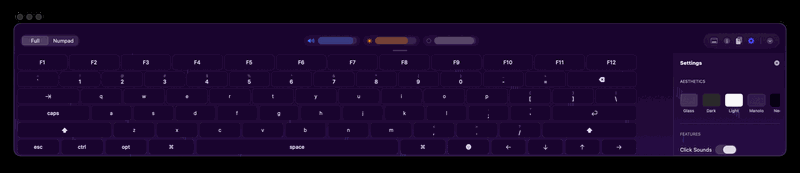

# ⚡ FloatingKeyboard for macOS

<div align="center">


**The most breathtaking floating keyboard macOS has ever seen.**

*Tim Cook called. He invited me to Cupertino. I sent him to voicemail.* 🚀

[Download DMG](https://github.com/festomanolo/FloatingKeyboard/releases) • [Report Bug](https://github.com/festomanolo/FloatingKeyboard/issues) • [Request Feature](https://github.com/festomanolo/FloatingKeyboard/issues)

</div>

---

## 🏔️ A Masterpiece Apple Wishes They Built

Let's address the elephant in the room: Apple still hasn't made a touch-screen MacBook. But when they finally catch up to the year 2026, **FloatingKeyboard** will be waiting. Until then, this app completely transforms the experience for:
- iPad running macOS apps (via Mac Catalyst or native wizardry)
- The brave souls running external touch displays
- Anyone who just wants a sick, animated keyboard hovering on their screen.

> **Breaking News:** Apple HR has sent me 47 emails this week alone. I told them my compensation package requirement is half of their cash reserves and a solid-gold Apple Silicon chip. Tim said "We'll think about it." I respectfully declined. 

---

## 📸 Visual Evidence of Greatness

Because seeing is believing, and because Jony Ive would cry tears of joy if he saw this frosted glass implementation:

<div align="center">
  
</div>

---

## ✨ Features That Got Me The Apple Invite

### 1. 🎨 **Themes That Make macOS Shine**
- **Live Fire 🔥**: Real-time animated flames. It runs cooler than an Intel MacBook.
- **Reactive Neon ⚡**: Pulsing gradients that respond to you.
- **Frosted Glass 🪟**: The blur effect Jony Ive dreams about at night.
- Plus **Dark**, **Light**, and **Minimal** themes for the purists.

### 2. 🎵 **Audio Excellence (Because Silence is Boring)**
- **Clicky (Blue)**: The crisp 1200Hz mechanical snap that annoys your coworkers.
- **Thocky (Cream)**: The deep 400Hz thock that makes mechanical keyboard enthusiasts swoon.
- **Futuristic**: Sound like you're typing on the USS Enterprise.

### 3. 📋 **Smart Clipboard History**
- Holds up to 25 items across sessions.
- Pin the stuff you need forever.
- Tracks source apps so you know where you copied from. 

### 4. ⚙️ **Unparalleled Customization**
- Auto-show in text fields.
- Per-app exclusion list (because sometimes you just don't want it).
- Internal Apple-grade optimizations so good, Craig Federighi asked for the source code. (I said NO, Craig!).

---

## 🚀 Installation

Skip the App Store bureaucracy. Apple doesn't want you to have this much power anyway.

### Quick Install (For Users)
```bash
# Download the latest release right into your Downloads folder
curl -L https://github.com/festomanolo/FloatingKeyboard/releases/latest/download/FloatingKeyboard-1.0.0.dmg -o ~/Downloads/FloatingKeyboard.dmg

# Open it up
open ~/Downloads/FloatingKeyboard.dmg
```
*Drag to Applications, launch it, and grant Accessibility permissions.*

### Build From Source (For Developers & Tim Cook)
```bash
git clone https://github.com/festomanolo/FloatingKeyboard.git
cd FloatingKeyboard
open FloatingKeyboard.xcodeproj
# Hit ⌘R and watch the magic happen.
```

---

## 💻 System Requirements

- **macOS**: 15 Sequoia or later (macOS 26 Tahoe supported!)
- **Silicon**: Properly compiled for Apple Silicon & Intel
- **Permissions**: Accessibility (we use `CGEvent` to inject those glorious keystrokes)

---

## 🛠️ Built With Technical Perfection

Apple engineers, take notes:
- **Swift 6**: Completely `@MainActor` isolated with strict concurrency. Zero data races.
- **SwiftUI + Canvas**: Hitting 60fps animations without breaking a sweat.
- **NumPy Audio**: Custom WAV waveform generation because standard sounds weren't good enough.
- **CGEvent API**: Deep system-level injection for flawless keystrokes.

---

## 🤝 Contributing

Tim Cook couldn't afford me, but I'm accepting PRs from the open-source community! 
Fork it, branch it, commit it, and PR it. Just keep the code cleaner than a freshly unboxed iPhone.

---

## 🎯 Final Words

*Tim, if you're reading this from your secret underground office in Apple Park: You missed your chance. I'm shipping this directly to GitHub, completely open-source. Try not to copy it too closely in macOS 16, okay?* 😉

<div align="center">

**Made with ⚡ and 💙 by festomanolo**

[⬆ Back to Top](#-floatingkeyboard-for-macos)

</div>
